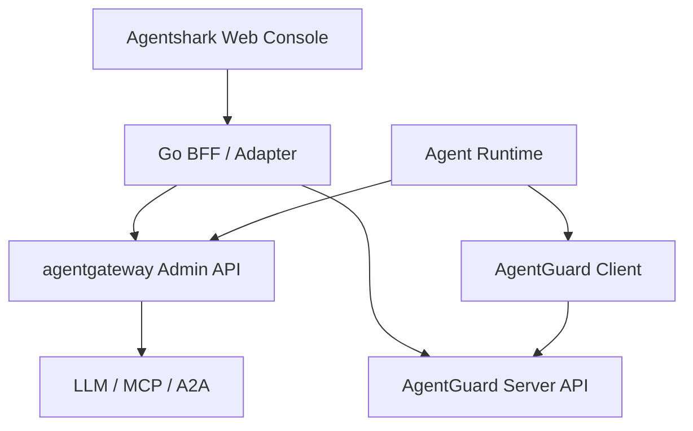

# Agentshark 全新仓库 Codex 执行方案

> 文档版本：2026-07-21  
> 适用目标：在全新仓库中从零实现轻量版 Agentshark  
> 核心定位：统一连接、可信上下文、运行时防护与审计控制台

## 0. 文档用途

本文件不是旧 Agentshark 的迁移方案，而是一个可直接交给 Codex 分阶段执行的新仓库实现规范。

执行时必须遵守以下优先级：

1. 先做前端产品骨架和动态体验，再接入真实上游。
2. 直接依赖 agentgateway 和 AgentGuard，不复制它们的规则引擎、网关、日志存储或原生前端实现。
3. Agentshark 只提供统一信息架构、薄适配层、跨来源聚合和高频操作入口。
4. 上游没有明确提供的字段或能力，不推断、不伪造、不通过时间接近度关联。
5. 任一阶段都必须保持可运行、可测试、可回滚。

参考项目：

- agentgateway：<https://github.com/agentgateway/agentgateway>
- AgentGuard：<https://github.com/WhitzardAgent/AgentGuard>
- 视觉参考站点：<https://agentshark.dev/>
- 视觉参考仓库：<https://github.com/AgentSharkHQ/website>

---

## 1. 产品边界

### 1.1 一句话定位

Agentshark 是 agentgateway 与 AgentGuard 之上的统一管理控制台，用一套界面完成 Agent 通信接入、可信上下文查看、策略防护和安全审计。

### 1.2 Agentshark 自己负责

- 统一部署与首次接入向导。
- 四个一级工作区：Connect、Trust、Protect、Audit。
- 首页的健康状态、关键指标、待审批和实时活动聚合。
- Go BFF 对两套上游 API 的认证隔离、错误统一、版本适配和数据归一化。
- 高频管理动作，例如审批、规则检查、常用标签修改。
- 具有适度动态感的控制台交互与实时状态反馈。
- 对高级、低频功能提供上游原生控制台的深链接。

### 1.3 明确不做

- Task 自动识别、Task DAG 或 Task Graph。
- Neo4j、PostgreSQL 事实平面或新的长期日志库。
- 主动流量重放、Replay Worker、Payload Vault。
- Agentshark 自研规则引擎、协议解析器或 Guardrail 引擎。
- Framework Hook、eBPF、透明代理或新的 SDK。
- OTel、Jaeger、Grafana 的重复实现。
- 通过时间窗口猜测 agentgateway 请求与 AgentGuard 事件属于同一任务。
- 把 Trust 页面描述成远程证明、密码学身份认证或完整零信任身份系统。

### 1.4 上游能力边界

| 能力来源 | 直接复用的能力 | Agentshark 的处理方式 |
|---|---|---|
| agentgateway | LLM、MCP、A2A、HTTP/gRPC 代理；Provider/Model/Route；认证、CEL、限流、Guardrail；日志、成本、延迟与分析 | Connect 和 Audit 的主要数据源；复杂配置跳转原生控制台 |
| AgentGuard | LLM/Tool 前后拦截；Tools/Skills/MCP 资源；Rules、Plugins、Approvals、Traffic、Audit、扫描与标签 | Trust、Protect 和 Audit 的主要数据源；保留来源与作用阶段 |
| Agentshark | 统一导航、聚合视图、标准化模型、状态流、动效与操作编排 | 不进入 Agent 的业务数据面 |

已核实的 AgentGuard Console API 包括 tools、skills、mcps、rules、stats、traffic、audit、approvals，以及 approve/deny 等接口。agentgateway 的原生 UI 已包含 Models、Providers、Policies、Guardrails、Costs、Logs、Analytics、MCP Servers、Traffic Listeners/Gateways/Routes 等入口。

---

## 2. 总体架构



核心约束：

- Agentshark 只连接管理面，不代理 Agent 的业务流量。
- agentgateway 和 AgentGuard 始终是独立进程。
- 浏览器只访问 Agentshark BFF，不持有上游 API Key。
- BFF 第一版无数据库；首页聚合与实时事件使用内存缓存和有界 ring buffer。
- 上游不可用时，页面显示 source-scoped degraded 状态，其他来源仍可使用。

---

## 3. 全新仓库结构

```text
agentshark/
├── apps/
│   ├── server/
│   │   ├── cmd/agentshark/main.go
│   │   ├── internal/
│   │   │   ├── api/
│   │   │   ├── auth/
│   │   │   ├── config/
│   │   │   ├── gateway/
│   │   │   ├── guard/
│   │   │   ├── aggregate/
│   │   │   ├── stream/
│   │   │   └── web/
│   │   ├── go.mod
│   │   └── go.sum
│   └── web/
│       ├── src/
│       │   ├── app/
│       │   ├── components/
│       │   ├── features/
│       │   │   ├── home/
│       │   │   ├── connect/
│       │   │   ├── trust/
│       │   │   ├── protect/
│       │   │   └── audit/
│       │   ├── lib/
│       │   ├── mocks/
│       │   ├── motion/
│       │   ├── styles/
│       │   └── types/
│       ├── tests/
│       └── package.json
├── api/
│   ├── openapi.yaml
│   └── upstream-contracts/
│       ├── agentgateway/
│       └── agentguard/
├── deploy/
│   ├── compose.yaml
│   ├── versions.env
│   └── example.env
├── docs/
│   ├── architecture.md
│   ├── capability-matrix.md
│   ├── motion-guidelines.md
│   ├── upstream-compatibility.md
│   └── screenshots/
├── scripts/
├── Makefile
├── AGENTS.md
├── README.md
└── LICENSE
```

不要使用 Git submodule，也不要 vendor 两个上游仓库。通过容器镜像或外部地址连接，并在 `deploy/versions.env` 固定已验证版本。

---

## 4. 技术选型

### 4.1 前端

- React 19 + TypeScript + Vite。
- Tailwind CSS 4，用 CSS Variables 保存 Design Token。
- TanStack Router 管理路由。
- TanStack Query 管理请求、缓存和 mutation。
- Recharts 实现趋势和分布图。
- Lucide React 实现图标。
- Motion for React 仅用于页面、抽屉、卡片和状态过渡。
- 自研轻量 SVG `LiveFlow`，表现实时连接和流量，不使用 Three.js/WebGL。
- MSW 提供 Mock API，使前端在 BFF 完成前即可独立开发和验收。
- Vitest + React Testing Library + Playwright。

### 4.2 后端

- Go 当前稳定版。
- 标准 `net/http` 或轻量路由器，避免引入重型框架。
- OpenAPI 作为 Agentshark 自有 API 的唯一契约。
- `http.Client` 分别实现 agentgateway 与 AgentGuard Adapter。
- SSE 作为浏览器实时事件通道；不使用 WebSocket。
- `slog` 输出结构化日志。
- 无数据库；使用有界内存缓存，进程重启可丢失聚合状态。

### 4.3 最小管理员保护

控制台包含策略写入和人工审批，不能默认无认证暴露到网络：

- `AGENTSHARK_ADMIN_TOKEN` 通过环境变量注入。
- 登录成功后换取 `HttpOnly + SameSite=Strict + Secure` Cookie。
- 所有写接口检查会话与 CSRF Token。
- 开发模式仅允许在 loopback 地址显式关闭认证。
- 日志和错误响应不得输出上游密钥、完整 Prompt、Authorization Header。

---

## 5. 信息架构与路由

```text
/
├── /connect
│   ├── /overview
│   ├── /llm
│   ├── /mcp
│   ├── /traffic
│   └── /setup
├── /trust
│   ├── /agents
│   ├── /resources
│   └── /scans
├── /protect
│   ├── /policies
│   ├── /guardrails
│   ├── /runtime-rules
│   ├── /plugins
│   └── /approvals
├── /audit
│   ├── /analytics
│   ├── /traffic
│   ├── /security-events
│   └── /sessions
└── /system
```

桌面端使用可折叠左侧导航；一级入口始终只展示 Home、Connect、Trust、Protect、Audit。System 位于底部，不成为第五个能力层。

全局顶栏包含：

- 环境名称。
- agentgateway/AgentGuard 双来源健康状态。
- 全局时间范围。
- 待审批计数。
- Command Palette。
- 用户与系统菜单。

---

## 6. 页面布局

### 6.1 Home：运行态势

首页只回答“是否正常、正在发生什么、是否需要人工处理”。

布局顺序：

1. 顶部欢迎区和双上游健康状态。
2. `LiveFlow`：Agent → Gateway/Guard → LLM/MCP/A2A 的实时 SVG 流量视图。
3. 四张指标卡：Requests、Active Agents/Sessions、Denied、Pending Approvals。
4. 左侧趋势图：请求量、延迟和错误率。
5. 右侧安全队列：最新 Deny、Human Check 和高风险 Audit。
6. 底部活动流：显示来源、对象、动作、决策和时间。

首次部署无数据时不展示空图表，改为三步接入向导：连接 agentgateway、连接 AgentGuard、发送验证请求。

### 6.2 Connect：连接与代理

主要数据源为 agentgateway。

- Overview：Listener、Gateway、Route、Backend 健康状态。
- LLM：Provider、Model、Virtual Model、Key 和 Cost 摘要。
- MCP：Server、Transport、Tool Federation 和 Policy 摘要。
- Traffic：HTTP/gRPC/A2A 的 Listener、Gateway、Route。
- Setup：Base URL、环境变量、验证命令和连通性检查。

高频只读信息原生显示；配置编辑器、CEL、Raw Config、Playground 等高级能力提供带上下文的“Open in agentgateway”按钮。

### 6.3 Trust：可信上下文与资源

主要数据源为 AgentGuard。

- Agents：Agent ID、状态、框架、Principal、Trust Level、Session 数、最后活动。
- Agent Detail：Identity、Sessions、Tools、Skills、MCP、Rules、Recent Activity。
- Resources：Tool、Skill、MCP 的统一资源表，但保留原始资源类型。
- Labels：Boundary、Sensitivity、Integrity、Tags。
- Scans：Skill/MCP 扫描状态、结果和来源。

Agent 身份必须来自 AgentGuard 明确字段。agentgateway 日志中的客户端信息不能自动升级为 Agent 身份。

### 6.4 Protect：策略与人工控制

必须在 UI 上始终显示 `Source + Scope + Phase + Action`：

| 类型 | Source | Scope/Phase | 常见 Action |
|---|---|---|---|
| Gateway Policy | agentgateway | Gateway / Request | Allow、Deny、Route、Rate Limit |
| Content Guardrail | agentgateway | Prompt / Response | Allow、Deny、Redact |
| Runtime Rule | AgentGuard | LLM Before/After、Tool Before/After | Allow、Deny、Human Check、LLM Check |
| Approval | AgentGuard | Runtime | Approve、Deny |

页面：

- Policies：按 Gateway 与 Runtime 分组，不合并成虚假的统一 DSL。
- Guardrails：展示 agentgateway 内容防护摘要并跳转高级配置。
- Runtime Rules：规则列表、语法检查、生成、发布和删除。
- Plugins：按执行阶段查看启用状态。
- Approvals：待处理队列、上下文详情、Approve/Deny 和必填备注。

删除规则、发布规则和审批属于高风险动作，必须使用确认对话框、mutation loading、成功回执和失败恢复。

### 6.5 Audit：流量与安全审计

- Analytics：请求、Token、Cost、Latency、Error、Deny 趋势。
- Traffic：agentgateway 请求日志。
- Security Events：AgentGuard 决策、风险和 Custom Auditor 结果。
- Sessions：AgentGuard Session 与其运行时事件。
- Unified Activity：只做并排统一展示，不能伪装成已完成 Task 关联。

统一详情抽屉字段：

- Timestamp、Source、Event Type、Severity。
- Agent/User/Session（存在才显示）。
- Provider、Model、Tool/Resource（存在才显示）。
- Policy/Rule、Phase、Decision。
- Sanitized Summary。
- Raw JSON，默认折叠并执行敏感字段遮蔽。

只有双方同时存在完全相同且经过验证的 `trace_id` 或 `session_id` 时，才显示 Correlated 标识。

---

## 7. 动态视觉系统

动态感的目标是让用户感知状态变化和流量，而不是让控制台持续运动。

### 7.1 视觉 Token

```css
:root {
  --bg-canvas: #070a0f;
  --bg-panel: #0b111b;
  --bg-elevated: #101927;
  --border-subtle: #1c2a3a;
  --text-primary: #eef5ff;
  --text-secondary: #91a1b5;
  --accent-blue: #5c92ff;
  --accent-cyan: #32d6e8;
  --status-success: #31c48d;
  --status-warning: #f6bd4a;
  --status-danger: #ff627d;
  --motion-fast: 140ms;
  --motion-normal: 240ms;
  --motion-enter: 420ms;
  --motion-ambient: 12s;
}
```

字体建议：Geist Sans 用于界面，Fira Code 或 JetBrains Mono 用于 ID、时间、模型和原始数据。视觉参考仓库未发现 LICENSE 文件，不复制其源码、模型、纹理或具体组件。

### 7.2 动效分层

| 层级 | 场景 | 动效 | 约束 |
|---|---|---|---|
| Ambient | 首页背景、LiveFlow | 极慢网格漂移、低亮度流动粒子 | 8–16 秒循环；不抢夺注意力 |
| Status | 健康、实时事件 | 呼吸点、边框扫光、新事件淡入 | 仅 active/pending 状态运动 |
| Navigation | 路由、Tab、Drawer | 淡入上移、共享指示条、spring drawer | 180–420ms |
| Data | 指标、图表、列表 | 数字滚动、路径补间、新行高亮 | 更新时触发，不持续循环 |
| Action | 保存、审批、删除 | 按压、loading、成功确认、错误震动 | 必须与真实请求状态绑定 |

### 7.3 核心动态组件

1. `LiveFlow`：SVG 分层拓扑，只有收到真实/Mock SSE 事件时才发射流动粒子。
2. `MetricTicker`：数值变化时平滑滚动，初次加载不从 0 播放虚假增长。
3. `StatusOrb`：healthy 静态微光、connecting 呼吸、degraded 缓慢黄色脉冲、down 红色静态。
4. `ActivityRail`：新事件从顶部淡入，并在 1.2 秒后取消高亮。
5. `PolicyDecision`：Allow/Deny/Human Check 使用一次性颜色过渡，不使用无限闪烁。
6. `DetailDrawer`：从右侧弹性进入，保持 URL 可分享，Esc 关闭并恢复焦点。
7. `SkeletonShimmer`：仅首屏请求使用；后台刷新保留旧数据并显示细小同步状态。

### 7.4 性能与可访问性门槛

- 支持 `prefers-reduced-motion`；关闭 ambient、粒子和数字滚动，只保留必要状态切换。
- 不对大表格行逐个添加常驻 Motion 实例。
- SVG 活跃粒子桌面端不超过 24 个；标签页隐藏时暂停动画。
- 不使用全屏 blur 动画和大面积 box-shadow 动画。
- 目标：常规笔记本持续 55–60 FPS，首页动画不导致明显风扇或电量异常。
- 所有颜色状态同时提供文字或图标，不依赖颜色单独传达意义。
- 动效不得延迟审批、保存、导航和错误提示。

---

## 8. BFF API 契约

### 8.1 核心接口

```text
POST /api/v1/auth/session
GET  /api/v1/system/health
GET  /api/v1/system/capabilities
GET  /api/v1/overview
GET  /api/v1/stream                       # SSE

GET  /api/v1/connect/summary
GET  /api/v1/connect/llm/providers
GET  /api/v1/connect/llm/models
GET  /api/v1/connect/mcp/servers
GET  /api/v1/connect/traffic/routes

GET  /api/v1/trust/agents
GET  /api/v1/trust/agents/{agentId}
GET  /api/v1/trust/resources
PATCH /api/v1/trust/agents/{agentId}/tools/{tool}/labels
POST /api/v1/trust/agents/{agentId}/skills/detect
POST /api/v1/trust/agents/{agentId}/mcps/detect

GET  /api/v1/protect/policies
POST /api/v1/protect/runtime-rules/check
POST /api/v1/protect/agents/{agentId}/runtime-rules
DELETE /api/v1/protect/agents/{agentId}/runtime-rules/{ruleId}
GET  /api/v1/protect/approvals
POST /api/v1/protect/approvals/{ticketId}/approve
POST /api/v1/protect/approvals/{ticketId}/deny

GET  /api/v1/audit/analytics
GET  /api/v1/audit/events
GET  /api/v1/audit/events/{source}/{eventId}
GET  /api/v1/audit/sessions
```

### 8.2 标准响应信封

```json
{
  "data": {},
  "meta": {
    "source": "agentgateway",
    "sourceVersion": "pinned-version",
    "fetchedAt": "2026-07-21T12:00:00Z",
    "stale": false
  }
}
```

错误格式：

```json
{
  "error": {
    "code": "UPSTREAM_UNAVAILABLE",
    "message": "AgentGuard is unavailable",
    "source": "agentguard",
    "requestId": "...",
    "retryable": true
  }
}
```

### 8.3 统一事件模型

```ts
type UnifiedEvent = {
  id: string;
  timestamp: string;
  source: "agentgateway" | "agentguard";
  kind: "traffic" | "decision" | "approval" | "audit" | "health";
  severity: "info" | "low" | "medium" | "high" | "critical";
  subject?: { agentId?: string; principalId?: string; sessionId?: string };
  target?: { provider?: string; model?: string; tool?: string; resource?: string };
  phase?: string;
  action?: string;
  decision?: string;
  correlation?: { traceId?: string; sessionId?: string; verified: boolean };
  summary: string;
  rawRef: { source: string; id: string };
};
```

归一化只能减少显示差异，不能丢弃 `source`、原始 ID 和原始详情引用。

### 8.4 Capability Detection

BFF 启动时分别执行：

1. 健康检查。
2. 版本读取。
3. 只读能力探测。
4. 生成 Capability Registry。

前端根据 Capability Registry 隐藏、禁用或标注功能。禁止仅按版本号猜测接口存在。

---

## 9. 实时事件实现

上游如果没有统一事件订阅接口，BFF 使用独立 poller：

- agentgateway logs/analytics：默认 2 秒轮询。
- AgentGuard traffic/audit/approvals：默认 2 秒轮询。
- health：默认 10 秒轮询。
- 根据 `source + upstream id` 去重。
- 每个来源保存最近 500 条事件的内存 ring buffer。
- 浏览器通过 `/api/v1/stream` 订阅 `health`、`traffic`、`decision`、`approval`。
- SSE 断线后使用 `Last-Event-ID` 尝试补发 ring buffer 内事件。
- 没有新事件时发送注释 heartbeat，不生成假流量。

页面不可见时前端暂停非关键动画，但保持低频数据同步。

---

## 10. 配置与部署

`deploy/example.env` 至少包含：

```dotenv
AGENTSHARK_LISTEN_ADDR=0.0.0.0:8080
AGENTSHARK_ENVIRONMENT=local
AGENTSHARK_ADMIN_TOKEN=change-me

AGENTGATEWAY_BASE_URL=http://agentgateway:15000
AGENTGATEWAY_ADMIN_TOKEN=
AGENTGATEWAY_CONSOLE_URL=http://localhost:15000/ui

AGENTGUARD_BASE_URL=http://agentguard:8000
AGENTGUARD_ADMIN_TOKEN=
AGENTGUARD_CONSOLE_URL=http://localhost:8000

AGENTSHARK_POLL_INTERVAL=2s
AGENTSHARK_REDACT_PAYLOADS=true
```

版本策略：

- 在实际开工当天重新确认两个上游的最新稳定版。
- 将验证通过的 tag 或 commit 固定在 `deploy/versions.env`。
- 禁止在默认 Compose 中使用 `latest`。
- 保存 API 契约样本和兼容性测试，不依赖上游内部代码结构。

AgentGuard 为 GPLv3，agentgateway 为 Apache-2.0。实现上保持独立进程和 HTTP API 集成，不复制 AgentGuard 源码；发布前保留依赖清单、许可证通知并完成正式许可证核查。

---

## 11. Codex 分阶段执行计划

### Phase 0：上游契约冻结与仓库初始化

目标：获得可复现的开发基线，不开始业务页面开发。

任务：

1. 创建新仓库与目录结构。
2. 添加 `AGENTS.md`、README、Makefile、基础 CI。
3. 选择并固定 agentgateway 与 AgentGuard 稳定版本。
4. 启动两个上游，记录 Health、Version 和所需 API 的真实请求/响应。
5. 将脱敏样本保存到 `api/upstream-contracts/`。
6. 编写 `docs/capability-matrix.md` 与 `docs/upstream-compatibility.md`。
7. 对计划中未找到的上游接口标为 `unverified`，不得临时猜测。

验收：

- `make verify` 可运行格式、静态检查和空测试套件。
- `docker compose config` 成功。
- 所有上游版本固定，无 `latest`。
- 能力矩阵逐项标记 supported、partial、link-out 或 unavailable。

建议提交：`chore: bootstrap agentshark and freeze upstream contracts`

### Phase 1：前端设计系统、Mock 与动态骨架

目标：不依赖 BFF，先完成可评审的完整控制台体验。

任务：

1. 初始化 React/Vite/Tailwind/TanStack。
2. 建立颜色、字体、间距、圆角、阴影、图表和 Motion Token。
3. 实现 AppShell、Sidebar、Topbar、Command Palette、Page Header、Card、Table、Empty、Error、Skeleton、Drawer、Dialog。
4. 使用 MSW 实现 overview、connect、trust、protect、audit 和 SSE mock。
5. 完成 Home 与四个一级页面的高保真布局。
6. 实现 `LiveFlow`、`MetricTicker`、`StatusOrb`、`ActivityRail`、`DetailDrawer`。
7. 加入 reduced-motion 模式和键盘导航。
8. 保存桌面 1440px 与笔记本 1280px 截图作为视觉基线。

验收：

- `npm run build`、typecheck、unit test、Playwright 全部通过。
- 五个一级页面都可从 Mock 数据工作。
- 页面刷新后详情抽屉 URL 可恢复。
- reduced-motion 下无持续动画。
- 无数据、加载、部分失败、全部失败四种状态均有明确页面。
- Lighthouse Accessibility 目标不低于 95。

建议提交：`feat(web): build animated console shell with mock workflows`

### Phase 2：Go BFF、认证与 Capability Registry

目标：建立稳定的 Agentshark API，不立即接完所有业务接口。

任务：

1. 实现配置加载、校验与 secret-safe 日志。
2. 实现单管理员会话、CSRF 和写接口中间件。
3. 实现两个上游 Client、超时、重试和统一错误。
4. 实现 health、version、capability detection。
5. 实现 `/overview` 与 `/stream`。
6. 根据 `api/openapi.yaml` 生成/校验前端 client。
7. 添加 fake upstream server 做契约测试。

验收：

- 一个上游断开时另一个仍可使用。
- 前端明确显示 partial/degraded，不出现全屏崩溃。
- API Key 不出现在前端 bundle、响应、日志和错误中。
- `go test ./...` 与 race test 通过。

建议提交：`feat(server): add secure bff and upstream capability detection`

### Phase 3：Connect 真实接入

目标：完成 agentgateway 高频只读能力和接入流程。

任务：

1. 接入 Providers、Models、MCP Servers、Traffic Routes 和 Analytics 摘要。
2. 实现 Connect Overview 与 Setup 验证请求。
3. 为 Raw Config、CEL、Playground 等生成原生控制台深链接。
4. 所有条目显示 `source=agentgateway` 和 fetched time。
5. 为缺失能力提供 unavailable 状态，不制造占位数据。

验收：

- 使用真实 agentgateway 数据完成列表、筛选、分页和详情。
- 上游升级导致契约变化时测试能够失败并指出具体字段。
- 不在此阶段重做 agentgateway 高级编辑器。

建议提交：`feat(connect): integrate agentgateway resources and setup flow`

### Phase 4：Trust 真实接入

目标：完成 AgentGuard Agent 与资源视图。

任务：

1. 从 AgentGuard 聚合 Agents、Sessions、Tools、Skills、MCP。
2. 实现 Agent Detail Workspace。
3. 实现 Tool Labels 修改。
4. 实现 Skill/MCP Scan 触发与结果查看。
5. 所有 Agent 身份字段保留来源与 unknown 状态。

验收：

- 不从 agentgateway 日志推断 Agent ID。
- 修改标签后有 optimistic pending，但以服务器响应为最终事实。
- Scan 长操作有进度/轮询、取消导航提示和错误恢复。

建议提交：`feat(trust): add agentguard identities resources and scans`

### Phase 5：Protect 写操作

目标：完成策略查看、运行时规则和人工审批。

任务：

1. 实现来源分组的 Policy 页面。
2. 接入 Runtime Rule check、publish、delete。
3. 接入 Approvals 队列及 approve/deny。
4. 为每次写操作加入确认、备注、请求 ID 和结果回执。
5. 防止重复点击与重复审批。
6. Guardrails 和 Gateway Policy 先只读或 link-out，除非契约在 Phase 0 已确认稳定。

验收：

- Approve/Deny E2E 使用 fake upstream 验证成功、404 已处理、超时和重试场景。
- 规则发布前必须通过 syntax check。
- 所有危险动作可审计且不会把敏感正文写入日志。

建议提交：`feat(protect): add runtime rules and guarded approval actions`

### Phase 6：Audit 与实时动态数据

目标：让动态界面绑定真实状态，形成完整产品闭环。

任务：

1. 接入 agentgateway Traffic/Analytics。
2. 接入 AgentGuard Traffic/Audit/Sessions。
3. 实现 Unified Activity、详情抽屉和 Raw JSON 脱敏。
4. 完成 poller、去重、ring buffer 和 SSE resume。
5. LiveFlow、ActivityRail、MetricTicker 改用真实 SSE。
6. 仅对经过验证的共同 ID 显示 Correlated。

验收：

- 新事件进入后首页和 Audit 在 3 秒内更新。
- SSE 重连不会重复插入事件。
- 页面隐藏时动画暂停，回到页面后数据正确。
- 5000 条连续模拟事件下内存保持有界，UI 不明显掉帧。

建议提交：`feat(audit): stream normalized gateway and guard activity`

### Phase 7：部署、文档与发布门槛

目标：新用户可在 10 分钟内看到第一条真实事件。

任务：

1. 完成多阶段 Dockerfile 与 Compose。
2. 实现启动健康检查和 `/system` 诊断页。
3. 编写 Quickstart、接入 Agent 示例、故障排查和版本兼容文档。
4. 完成全链路 E2E：启动 → 登录 → 连接 → 发送请求 → 查看事件 → 审批。
5. 生成 SBOM、依赖许可证清单和安全扫描结果。
6. 录制或保存首页、四工作区与 degraded 状态截图。

验收：

- 全新环境按 README 可启动。
- 未设置默认密码/Token 时拒绝以非 loopback 地址启动。
- 两个上游分别断开时诊断页给出可操作建议。
- CI 包含 Go、Web、契约、E2E、容器构建和 secret scan。

建议提交：`release: prepare reproducible agentshark preview`

---

## 12. Codex 每阶段执行协议

向 Codex 下发每一个 Phase 时，都附带以下固定要求：

```text
你正在全新 Agentshark 仓库中执行当前 Phase。

开始前：
1. 阅读 AGENTS.md、README、docs/architecture.md、docs/capability-matrix.md。
2. 检查 git status，不覆盖用户已有修改。
3. 核对当前 Phase 的前置验收是否通过。
4. 对上游字段先查 api/upstream-contracts；未验证字段不得猜测。

实现时：
1. 只完成当前 Phase，不提前加入 Task Graph、Replay、数据库或自研策略引擎。
2. 所有 UI 数据必须标明来源，动态效果必须绑定真实或明确标识的 Mock 状态。
3. 保持一个上游故障时另一个上游仍可用。
4. 不把 secret、完整敏感 payload 或 Authorization Header 输出到浏览器和日志。
5. 先补测试再完成实现，并保持改动可独立提交。

结束前：
1. 运行当前 Phase 规定的格式化、类型检查、单元测试和 E2E。
2. 更新 capability matrix、OpenAPI、兼容性文档和截图。
3. 汇报改动、测试结果、已知限制和下一 Phase 前置条件。
4. 不自动 push 或创建 PR，除非用户明确要求。
```

---

## 13. 第一条可直接交给 Codex 的启动指令

```text
请在当前空白仓库中执行《Agentshark 全新仓库 Codex 执行方案》的 Phase 0。

这是全新实现，不读取或复制旧 Agentshark 仓库代码。系统定位是 agentgateway 与 AgentGuard 之上的统一控制台，一级能力固定为 Connect、Trust、Protect、Audit；不实现 Task Graph、Replay、Neo4j、PostgreSQL、自研规则引擎或新的流量采集器。

本阶段只做仓库初始化、上游稳定版本固定、真实 API 契约采集、能力矩阵和基础 CI，不开始业务页面。必须通过独立进程与 HTTP API 集成两个上游，不使用 Git submodule，不复制 AgentGuard 源码。对无法核实的 API 标记 unverified，并在总结中列出，禁止猜测字段。

完成后运行 Phase 0 的全部验收命令，更新文档并给出建议 commit message，但不要自动 push。
```

---

## 14. 最终 Definition of Done

只有同时满足以下条件，轻量版 Agentshark 才算完成：

- 一个新用户可从 Setup 页接入两个上游并看到验证结果。
- Home 能准确反映两个来源健康状态、关键指标、待审批与实时活动。
- Connect、Trust、Protect、Audit 四个入口均使用真实数据完成核心流程。
- 高级能力可通过明确深链接进入上游原生控制台。
- 任一来源故障不会导致整个控制台不可用。
- 所有数据和操作保留 source、scope、phase 和原始引用。
- 动态效果由真实状态驱动，并支持 reduced-motion。
- 不存在 Task 推断、虚假关联或上游并未提供的能力展示。
- 无默认弱认证、前端密钥泄露或敏感 payload 日志泄露。
- 版本固定、契约测试、E2E、容器构建和发布文档齐全。

这版产品的核心不是再造第三套系统，而是把两套成熟底层能力整理成一个更易理解、更易操作、状态变化可感知的 Agent 安全控制台。
